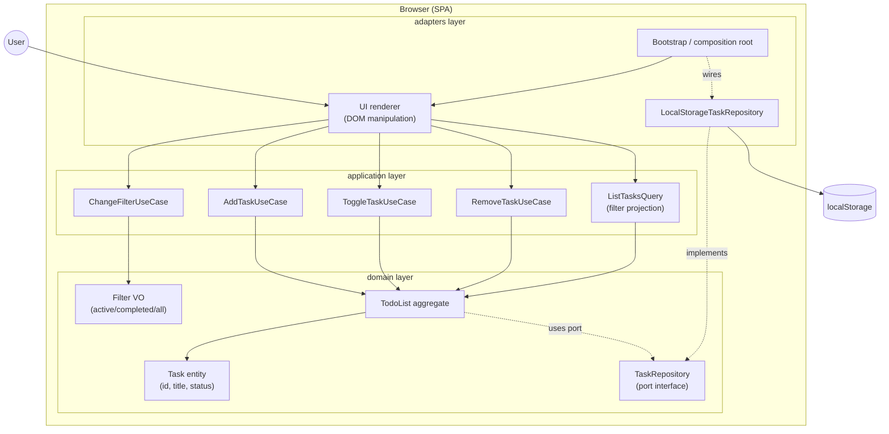

# Architecture проекта `todo-list`

## 1. Назначение

Продвинуть Software System до `Architecture Selected` и Requirements до `Coherent`.
Метод: одностраничное описание структуры с одной диаграммой.

## 2. Привязка к фазе и методу

- **Фаза:** architecture.
- **Уровень SME:** pet.
- **Дисциплины:** software-architecture, functional-decomposition.
- **Инструмент:** Mermaid-диаграмма (см. `catalogs/method-tool-matrix.md`).
- **Роль-автор:** product-owner (выступает также архитектором на pet-проекте).

## 3. Содержание

### 3.1. Стиль архитектуры

Hexagonal (Ports & Adapters) с DDD-lite слоями.
Границы слоёв обеспечивают тестируемость domain без DOM и localStorage.
Приоритет: простота выше гибкости; данные валидируются на границе.

### 3.2. Слои и ответственности

| Слой | Ответственность | Зависит от |
|---|---|---|
| `domain` | Сущности, Value Objects, инварианты, бизнес-правила | ничего (pure TypeScript) |
| `application` | Use cases: add/toggle/remove, filter-state | `domain` через интерфейсы-порты |
| `adapters` | DOM-рендер, обработчики событий, localStorage, загрузка | `application` и `domain` |

Правило зависимостей: указывают только внутрь (adapters → application → domain).
Domain не импортирует ничего из application или adapters.

### 3.3. Контейнер-диаграмма (Mermaid)



### 3.4. Ключевые абстракции

- **`Task`** — сущность; поля `id: TaskId`, `title: string (1..200)`, `status: active|completed`.
- **`Filter`** — Value Object; `active | completed | all`.
- **`TodoList`** — aggregate; инкапсулирует список задач и инварианты.
- **`TaskRepository`** — port-интерфейс; `load(): Task[]`, `save(tasks: Task[])`.
- **`LocalStorageTaskRepository`** — adapter; реализация порта с runtime-схемой.
- **Use cases** — команды: `addTask`, `toggleTask`, `removeTask`, `changeFilter`.
- **Query** — проекция: `listTasks(filter): Task[]`.

### 3.5. Структура папок

```
src/
├── domain/
│   ├── task.ts              // Task entity + invariants
│   ├── task-id.ts           // TaskId VO
│   ├── filter.ts            // Filter VO
│   ├── todo-list.ts         // Aggregate
│   └── task-repository.ts   // Port interface
├── application/
│   ├── add-task.ts
│   ├── toggle-task.ts
│   ├── remove-task.ts
│   ├── change-filter.ts
│   └── list-tasks.ts        // Query projection
├── adapters/
│   ├── ui/
│   │   ├── App.tsx          // Root React component, composition root
│   │   ├── TodoApp.tsx      // Container, wires use cases
│   │   ├── TaskInput.tsx    // add-form
│   │   ├── TaskList.tsx     // list rendering
│   │   ├── TaskItem.tsx     // toggle + remove controls
│   │   └── FilterBar.tsx    // filter selection
│   └── storage/
│       ├── local-storage-repository.ts
│       └── task-schema.ts   // Runtime schema + validation
└── main.tsx                 // Entry point (ReactDOM.createRoot)
```

### 3.6. Целостность данных

- **В domain-конструкторах:** `new Task(id, title, status)` бросает исключение на невалидных аргументах.
- **В storage-адаптере:** runtime-схема валидирует каждый элемент перед reconstruct.
- **На границе:** невалидные данные из localStorage помечаются как corrupt; пользователь видит пустой список.
- **Защита от устаревшей схемы:** версия данных в ключе `todo-list:v1`.

### 3.7. Качественные атрибуты

| Атрибут | Стратегия | Свидетельство |
|---|---|---|
| Простота | минимум абстракций; VO только там, где нужны инварианты | 3 слоя, ≤10 файлов в каждом |
| Целостность данных | инварианты в конструкторах + runtime-схема в storage | задача не может иметь пустой title |
| Тестируемость | domain и application не зависят от DOM/localStorage | fake repository в unit-тестах |
| Локальность | всё в браузере; нет сети, нет сервера | NFR-01, NFR-02 выполнены |

### 3.8. Технологический стек

| Компонент | Выбор | Мотив |
|---|---|---|
| Язык | TypeScript | статическая типизация; проверяется на границах |
| Бандлер | Vite | быстрый dev-server, нативный ESM, минимум конфига |
| UI-фреймворк | React 18 | выбран на фазе development; знаком команде, широкий тулинг |
| Storage | Web Storage API (localStorage) | pet-требование, zero-config persistence |
| Runtime-схема | zod | выбран на фазе development; композируемые parsers |

Примечание: исходная версия artifact'а предполагала vanilla DOM; решение о React пересмотрено на фазе development (см. `decisions.md` 2026-04-23). Hexagonal-границы сохранены: React живёт в `adapters/ui/`, domain и application остаются независимыми от React.

### 3.9. Отвергнутые альтернативы

- **Vanilla DOM (изначальный выбор):** пересмотрен на фазе development в пользу React; учебная цель включает практику React+RTL+hooks.
- **Vue/Svelte:** рассмотрены как альтернативы React; отвергнуты по знакомству команды.
- **Feature-sliced layout:** один bounded-контекст; избыточно.
- **Полный DDD (Aggregate Events, CQRS, Event Sourcing):** педагогично, но не нужно для 8 требований.
- **Unsafe TypeScript cast из localStorage:** ломает целостность при ручной правке.
- **Бэкенд на Node/Express:** противоречит NFR-01 (localStorage) и NFR-02 (без регистрации).

## 4. Трассируемость

- **traces_from:**
  - `phases/vision/vision.md` — ценность и не-цели (нет сервера, нет регистрации).
  - `phases/requirements/requirements.md` — US-01..US-06, NFR-01, NFR-02.
- **traces_to:** `phases/testing/` (TDD-контракты), `phases/development/` (реализация).
- **Альфы:** Software System → `Architecture Selected`; Requirements → `Coherent`.
- **Требования ↔ компоненты:**

| Требование | Компонент |
|---|---|
| US-01 add | `AddTaskUseCase` + `Task` + `TodoList` |
| US-02 toggle | `ToggleTaskUseCase` + `Task.toggle()` |
| US-03 remove | `RemoveTaskUseCase` + `TodoList.remove()` |
| US-04..US-06 фильтры | `Filter` VO + `ListTasksQuery` + `ChangeFilterUseCase` |
| NFR-01 persistence | `TaskRepository` port + `LocalStorageTaskRepository` adapter |
| NFR-02 без регистрации | отсутствие `auth` модуля и сервера; bootstrap без user |

## 5. Критерии готовности

- Артефакт валиден (`validate-artifact.sh`): frontmatter, секции, ≤15 слов.
- Есть ≥1 диаграмма (Mermaid) с компонентами по слоям.
- Каждое требование (US/NFR) имеет минимум один компонент.
- Правило зависимостей сформулировано явно.
- Отвергнутые альтернативы перечислены с мотивом.
- `traces_from` указывает на vision и requirements артефакты.
