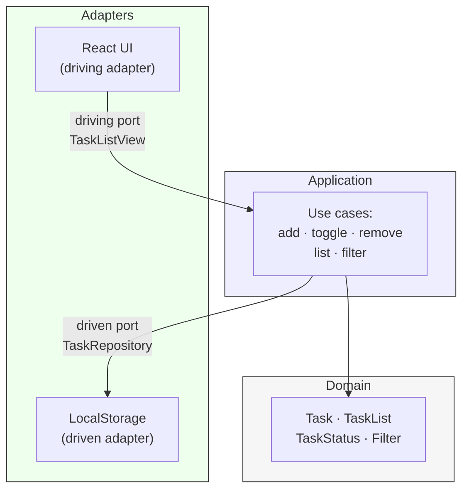

# Architecture: todo-list

## 1. Назначение

Артефакт продвигает альфы Software System и Requirements.
Метод — одностраничное описание структуры с одной Mermaid-диаграммой.

## 2. Привязка к фазе и методу

- Фаза: architecture.
- Уровень SME: pet.
- Дисциплины: software-architecture, functional-decomposition.
- Инструмент: Mermaid-диаграмма (см. `catalogs/method-tool-matrix.md`).
- Подсистемы как отдельные системы внимания сейчас не заводятся.

## 3. Содержание

### 3.1. Стиль архитектуры

SPA с hexagonal-архитектурой (Ports & Adapters) и DDD-lite.
Домен изолирован от UI и persistence; зависимости направлены внутрь.

### 3.2. Слои и ответственности

| Слой        | Ответственность                                            | Знает о                        |
| ----------- | ---------------------------------------------------------- | ------------------------------ |
| domain      | Сущности и инварианты (Task, TaskList, TaskStatus, Filter) | только себе                    |
| application | Сценарии: add, toggle, remove, list, filter                | domain, ports                  |
| adapters    | Реализация портов: UI, storage                             | application, домен через порты |

### 3.3. Порты и адаптеры

| Порт           | Направление | Адаптер                    | Замена                              |
| -------------- | ----------- | -------------------------- | ----------------------------------- |
| TaskRepository | driven      | LocalStorageTaskRepository | InMemoryTaskRepository (для тестов) |
| TaskListView   | driving     | ReactTaskListView          | любой другой UI-адаптер             |

### 3.4. Диаграмма

### 3.5. Качественные атрибуты

| QA                 | Тактика                                                                                         |
| ------------------ | ----------------------------------------------------------------------------------------------- |
| Простота           | Отсутствие серверной части; плоская структура; минимум зависимостей                             |
| Целостность данных | Инварианты в domain; единая точка записи через TaskRepository; валидация на границе application |

### 3.6. Технологический стек

| Назначение           | Выбор                                                 |
| -------------------- | ----------------------------------------------------- |
| Язык                 | TypeScript (строгая типизация для целостности domain) |
| Bundler / dev server | Vite                                                  |
| UI-фреймворк         | React (driving-адаптер)                               |
| Storage              | Web Storage API через LocalStorage-адаптер            |
| Менеджер пакетов     | npm                                                   |

Выбор обоснован в `decisions.md`, запись от 2026-04-22.

### 3.7. Отображение требований на слои

| Требование                          | Реализуется в               |
| ----------------------------------- | --------------------------- |
| R-1..R-3 (add/toggle/remove)        | application → domain        |
| R-4..R-7 (список и фильтры)         | application → UI-adapter    |
| R-8..R-9 (localStorage persistence) | LocalStorageTaskRepository  |
| N-1..N-4 (single-user, client-only) | вся архитектура без backend |

### 3.8. Значимые решения

1. Hexagonal: тестируемость domain без UI и без браузера.
2. Storage как driven-порт: localStorage легко заменить (например, на IndexedDB) без правки domain.
3. React как driving-адаптер: сужен до одного слоя; domain не зависит от React.
4. Без state-менеджера (Redux/Zustand): состояние живёт в application и адаптерах.

## 4. Трассируемость

- `traces_from`: `.claude/sdlc/phases/requirements/requirements.md` (R-1..R-9, N-1..N-4).
- `traces_to`: будет заполнено в фазе testing.
- Состояние альф: `.claude/sdlc/alphas.md`.
- Системы внимания: `.claude/sdlc/system-context.md` (целевая — корень).

## 5. Критерии готовности

- Артефакт проходит `validate-artifact.sh`.
- Альфа Software System не ниже Architecture Selected: стиль, слои, порты зафиксированы.
- Альфа Requirements не ниже Acceptable: NFR закрыты hexagonal-разрезом.
- `check-cross-refs.sh` не находит осиротевших ссылок.
